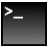

#  Console x64

Static x64 assembler library for console usage

## Usage

* Copy `Console.inc` to your `uasm\include` folder (or wherever your includes are located)
* Copy `Console.lib` to your `uasm\lib\x64` folder (or wherever your 64bit libraries are located)
* Add the following to your project:
```assembly
include Console.inc
includelib Console.lib
```

## RadASM Autocomplete
Additional RadASM autocomplete / intellisense type files are also included for ease of use. Each .api.txt file contains instructions as to where to paste their contents to add this feature to RadASM for using this library.

## Functions

Basic documentation on the functions in this library are located on the wiki [here](https://github.com/mrfearless/libraries/wiki/Console-x64-Functions)

## Download

The latest downloadable release is available [here](https://github.com/mrfearless/libraries/blob/master/releases/Console_x64.zip?raw=true)