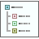

#  Treeview

Static assembler library (x86 and x64) for handling windows treeview controls

The library was created for my own convenience. Some functions are similar to the win32 treeview macros, others are just wrappers around SendMessage calls that I found I was using frequently, and thus decided to package or wrap them up for my own ease of use.

Basic documentation on the functions in the libraries are located on the wiki: 
* [Treeview-x86-Functions](https://github.com/mrfearless/libraries/wiki/Treeview-x86-Functions)
* [Treeview-x64-Functions](https://github.com/mrfearless/libraries/wiki/Treeview-x64-Functions)

The latest downloadable releases are available [here](https://github.com/mrfearless/libraries/releases)
